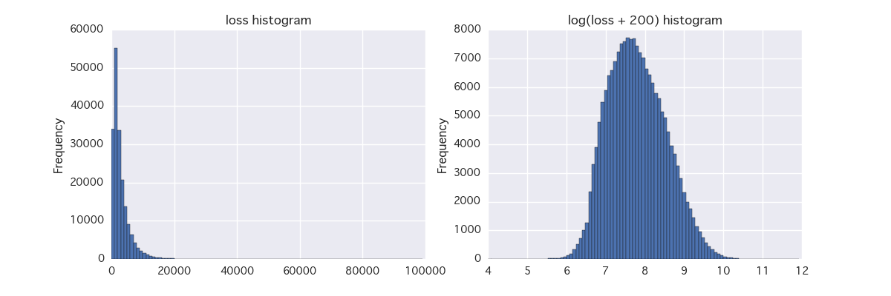

<h1>Capstone Project</h1>
<h2>Machine Learning Engineer Nanodegree</h2>
<p align="right">Fujiki Nakamura</p>


<h2 align="center">Definition</h2>

<h3>Project Overview</h3>
<p>&nbsp;&nbsp;
In this project, I solve a problem provided by Kaggle. Kaggle is a Data Science competition platform and provide their competitors with a lot of data in real world. Many companies are working with Kaggle and sharing their data on the platform of Kaggle to discover the method that produce the best result and the talented competitors. Competitors at Kaggle make the most of their Data Analysis and Machine Learning skills and aim to win their competitions. Kaggle is also platform of learning practical skills of Data Science and helps many junior Data Scientists to advance their skills providing discussions on the forum and open scripts.
</p>
<p>&nbsp;&nbsp;
The problem I solve in this project is provided by AllState corporation, which is [the second largest personal insurer in the United States](https://en.wikipedia.org/wiki/Allstate). They provide their data including the information of how severe an insurance claim is and other information that can be useful to predict the severity. According to the Kaggle home page of this competition, they are [currently developing automated methods of predicting the cost, and hence severity, of claims](https://www.kaggle.com/c/allstate-claims-severity)  and looking for the talented competitors to recruit.
</p>
<p>&nbsp;&nbsp;
The objective for this project is not recruitment, but through this problem I provide a case study of developing automated methods to produce good predictions.
</p>

<h3>Problem Statement</h3>
<p>&nbsp;&nbsp;
This is a problem of regression because the target value (, which is the severity here) is numerical and a problem of supervised learning because the target value is explicitly provided in the training dataset and we have to predict the scores for the test dataset. In such a kind of problem, I need to build the model which predicts the cost of claims that Allstate's customers have to pay as correctly as possible. In order to achieve that goal, I follow the strategy outlined below:

<ol type="1">
  <li>
    Data Exploration:
    </br>explore the data and grasp how it looks like. In this process, I examine the meanings and distributions of the data.
  </li>
  <li>
    Data Preprocessing:
    </br>preprocess the data in a way the each model built later can handle them appropriately. Convert some type of values into another type of values to feed them into the models appropriately, transform some values to correct their skewness in distributions and remove some unnecessary values.
  </li>
  <li>
    Building Machine Learning models:
    </br>Develop several Machine Learning models to approach the solution. Build the baseline models and define their performance as the criteria of improvement later.
  </li>
  <li>
    Tuning the models:
    </br>enhance the performance of the models built in step 3. Tune the hyper parameters of the models, make the better architecture of the models and so on.
  </li>
  <li>
    Ensembling the models:
    </br>To achieve the better performance than the single models above, ensemble them introduce the method of stacking.
  </li>
</ol>

</p>

<h3>Metrics</h3>
<p>&nbsp;&nbsp;
The metric to measure the performances is [Mean Absolute Error (MAE)](https://en.wikipedia.org/wiki/Mean_absolute_error). In addition to the fact that the competition requires MAE as the metric, MAE is appropriate because it measures the difference between predicted values and ground truth values directly. Of course, other metrics like MSE or RMSE seem appropriate but they have a "side effect" which we don't want here. When they square the differences, they make bigger errors bigger and smaller errors smaller (More precisely, when squared, errors more than 1 have bigger impact on the total error and errors less than 1 have smaller). MAE is one of the appropriate metrics to measure how much the difference is between the monetary values and to handle all errors equally, and interpreting the difference is intuitively easy (e.g How much differs from the true cost).
</p>


<h2 align="center">Analysis</h2>

<h3>Data Exploration</h3>
<p>&nbsp;&nbsp;
The dataset consists of 188,318 training data and 125,546 test data. The training data has 132 features and the test data has 131 features. The difference is a feature of `loss`, which means the cost of the insurance claims. The training data has it but the test data does not. The feature `loss` is our target variable and our predictions have to be as close as possible to that value. The mean of the `loss` is 3037.34 and it turns out that the average cost is $3037.34. The standard deviation is 2904.09, the minimum is 0.67, the maximum is 121012.2, and the median is 2115.57.
</p>
<p>&nbsp;&nbsp;
The other feature that the models don't need in their training process is `id`. As its name suggests, it identifies the each row of the each dataset. We have 188,318 `id`s in training data and 125,546 in test data.
</p>
<p>&nbsp;&nbsp;
The main features of our dataset are continuous features and categorical features. In our Machine Learning step, we feed these two types of features into our models. We have 116 categorical features and 14 continuous features. However, we don't know the meanings of these features. The Allstate prepared the dataset really well, and all the features we need to build models are anonymized. This is the characteristic of this problem. We have to achieve the best performance without human intuitions.
</p>
<p>&nbsp;&nbsp;
The categorical features are named from `cat1` to `cat116`, and they have at least two values represented in the uppercase alphabet. For example, `cat1` has two unique values, 'A' and 'B'. The largest part of the categorical features are binaries, and in fact the categorical features from `cat1` to `cat72` have two unique values of 'A' and 'B'. Other categorical features from `cat73` to `cat76` have three unique values 'A', 'B' and 'C'. And as expected, there are also some categorical features that have more than three unique values: from `cat77` to `cat88` have 4 unique values and from `cat89` to `cat108` and `cat111`, `cat114` and `cat115` have 5 unique values or more. Almost all the categorical features consist of the single letter values as mentioned above, but some categorical features consist of 2-letter values. The features from `cat109` to `cat116` (except `cat111`, `cat114` and `cat115`) have not only single letter values but also 2-letter values like 'AA', 'AB' and 'BY'. It might be noted that 2-letter values in '\*Z' form rarely appear, and actually `cat109` barely has 'ZZ' in its values.
</p>
<p>&nbsp;&nbsp;
As mentioned above, we have 14 continuous features. All the continuous features are scaled between 0 and 1. Checking the distributions of these continuous features, it is found that the distributions of the train data is similar to that of the test data. In other word, the corresponding continuous features in those two dataset have almost the same distribution respectively. Therefore, it seems that we don't have to concern about the problem resulting from distribution differences between train data and test data. The distribution of the each continuous feature in the training data vary and is different from each other. Some of them have distributions like the gaussian (for example, `cont3`). Some of them have skewed distributions: the features like `cont6` and `cont7` have right skewed distributions. In `cont5`, the skewness of the distribution is really high and there seem to be a lot of small values in `cont5` while there are few of the larger values.
</p>

<table>
<caption>Summary of the categorical features</caption>
<tr>
  <th>name</th>
  <th>Description</th>
  <th>Example</th>
</tr>
<tr>
  <td>cat1 to cat72</td>
  <td>Binary categorical feature</td>
  <td>A, B</td>
</tr>
<tr>
  <td>cat73 to cat76</td>
  <td>3 values</td>
  <td>A, B, C</td>
</tr>
<tr>
  <td>cat77 to cat87</td>
  <td>4 values</td>
  <td>A, B, C, D</td>
</tr>
<tr>
  <td>cat88</td>
  <td>4 values without C</td>
  <td>A, B, D, E</td>
</tr>
<tr>
  <td>cat89 to cat108, cat111, cat114, cat115</td>
  <td>5 or more values</td>
  <td>A, B, C, D, E, etc</td>
</tr>
<tr>
  <td>cat109, cat110, cat112, cat113, cat116</td>
  <td>2-letter values also appear</td>
  <td>A, B, AA, BA, CI, etc</td>
</tr>
</table>

<h3>Exploratory Visualization</h3>
</img>
<p>&nbsp;&nbsp;
Above are the histograms of 14 continuous features from `cont1` to `cont14`. For each histogram, the x-axis are the values that each continuous feature can take and y-axis is the frequency. I showed this visualization to show you the characteristics of the continuous features. They are well preprocessed and anonymized, ranging between 0 and 1. Some features like `cont3` has the distribution like the gaussian. On the other hand, some features like `cont6` has the right skewed distribution.
</p>
<p>&nbsp;&nbsp;
The `cont2` seems to have an interesting distribution. It has some kind of beautiful distribution compared to the other continuous features, but the values it can take are discretely distributed. It is said that the `cont2` might be originally an categorical feature and converted to a continuous one. In another experiment, considering the special characteristics of the features like this might be helpful. We don't consider such characteristics here.
</p>

<h3>Algorithms and Techniques</h3>
<p>&nbsp;&nbsp;
I chose two algorithms for this problem, Gradient Boosting Decision Tree and Neural Network.
</p>

<p>
<b>Gradient Boosting Decision Tree</b>
<br>&nbsp;&nbsp;
The package used is Extreme Gradient Boosting, XGBoost for short. XGBoost is a decision tree based algorithm and ensembles many trees to get better performance as a whole. So in terms of model (= tree ensembles), it is the same as Random Forest. The difference is the way it learns. While Random Forest learns in a way that it makes trees that are different with each other grow in parallel and aggregates the result of each tree, XGBoost learns by making trees grow in sequence. When XGBoost learns, each tree learns what the previous trees didn't learn. In other word, the next tree learns and tries to minimize the error that the previous trees left. For example, the 3rd tree learns and minimizes the error that 1st and 2nd trees left. Sequentially ensembling trees, XGBoost gains better performance as a whole (For more detailed explanation of XGBoost, you can refer to [Introduction to Boosted Trees](http://xgboost.readthedocs.io/en/latest/model.html).)
</p>
<p>&nbsp;&nbsp;
Recently, XGBoost is popular among the competitors. It became widely known through the competition of [Higgs Boson Machine Learning Challenge](https://www.kaggle.com/c/higgs-boson), where the 1st place winner used XGBoost. In addition to my interest in solving problems with XGBoost, its popularity and competence made me choose the algorithm to solve the problem here. I admit that there is no best algorithms for solving any kind of Machine Learning problem, but its popularity shows that XGBoost is competent and as one of the Machine Learning algorithms we can take the advantage of it at almost any time.
</p>
<p>&nbsp;&nbsp;
Ensembling by stacking might not often be used in the outside of competitions, but in terms of producing more generalized results (hence more better predictions), it seems appropriate in this problem. Stacking is almost always useful in circumstances in which we have to get as accurate result as possible.
</p>

<p>
<b>Neural Network</b>
<br>&nbsp;&nbsp;
Another model for this problem is Neural Network. Neural Network here is a kind of Multi-Layer Perceptron and it has multiple fully connected layers in its architecture. Neural Network is recently famous with the deep version of it (Deep Neural Network, or Deep Learning). Neural Network is said to work as any kind of functions approximately, so it is expected that it is powerful to solve the problem here.
</p>
<p>&nbsp;&nbsp;
Although it seems powerful, Neural Network is prone to overfit and not to generalize itself well to unseen data. We have to pay attention to that fact. Fortunately, we have several techniques to avoid overfitting: L1 or L2 regularization, Dropout and Batch Normalization. Among them, Batch Normalization is the newest technique and used in this problem later. For more information about it, we can refer to the paper of [Batch Normalization: Accelerating Deep Network Training by Reducing Internal Covariate Shift](https://arxiv.org/abs/1502.03167).
</p>
<p>&nbsp;&nbsp;
The final step to solve the problem is ensembling model by stacking them. To have better performance by stacking, it is said to be good to have different kind of algorithms in one stacking level. Neural Network works in a very different way than XGBoost, so it is appropriately chosen also in terms of stacking.
</p>
<p>&nbsp;&nbsp;
The package used for Neural Network models here are Tensorflow and Keras. "Tensorflow is an open source software library for numerical computation using data flow graphs" as mentioned in [its documentation](https://www.tensorflow.org/). On the other hand, Keras "is a high-level neural networks library, written in Python and capable of running on top of either TensorFlow or Theano. It was developed with a focus on enabling fast experimentation. Being able to go from idea to result with the least possible delay is key to doing good research.", which is cited from [its documentation](https://keras.io/). Neural Network models were built using Keras with Tensorflow backend.
</p>

<p><b>Stacking</b>
<br>&nbsp;&nbsp;
Stacking is a technique to ensemble multiple Machine Learning algorithms. In stacking, we select some algorithms as 1st level models and make predictions with each algorithms. Then we use the 1st level predictions as the input for the 2nd level models. Thus we ensemble the previous level models by learning with the current level models. The level can be more than two. So we can have 3rd level models using various algorithms. The method of stacking is also mentioned in this competition forum, and its concept and the way it works is well outlined in [Stacking understanding. Python package for stacking](https://www.kaggle.com/c/allstate-claims-severity/forums/t/25743/stacking-understanding-python-package-for-stacking). For more detailed explanation of the concept and the methodology, we can refer to the paper of [Stacked Generalization](http://www.machine-learning.martinsewell.com/ensembles/stacking/Wolpert1992.pdf).
</p>

<h4>Benchmark</h4>
<p>
<br>&nbsp;&nbsp;
We have three benchmarks here: Random Forest benchmark, XGBoost benchmark and Neural Network benchmark.
</p>
<p><b>Random Forest benchmark</b>
<br>&nbsp;&nbsp;
We have a benchmark from Random Forest which Allstate might have trained before the competition. The Random Forest Benchmark scored the `MAE = 1217.52141` on the Public LeaderBoard. This benchmark is not so good, and some XGBoost models which some participants had developed had already beaten the score when I joined the competition.
</p>

<p><b>XGBoost benchmark</b>
<br>&nbsp;&nbsp;
The XGBoost Benchmark is about `MAE = 1114` on the Public LeaderBoard. The XGBoost model which produced the score is suggested by Vladimir Iglovikov on [his kernel of xgb 1114](https://www.kaggle.com/iglovikov/allstate-claims-severity/xgb-1114). As shown in the kernel, the hyper parameters of the benchmark model of XGBoost are `min_child_weight = 1`, `max_depth = 12`, `eta = 0.01`, `colsample_bytree = 0.5`, `subsample = 0.8`, `alpha = 1` and `gamma = 1`. Also, this model trained with the target value `loss` transformed into `log(loss + 200)`. This transformation is mentioned later. While this model scored about `MAE = 1114` on the Public LeaderBoard, the model scored `mean MAE = 1134.77` on 5-Fold Cross Validation. We start from this XGBoost model and are going to enhance the predictivity of XGBoost model.
</p>

<p><b>Neural Network benchmark</b>
<br>&nbsp;&nbsp;
The Neural Network benchmark is `mean MAE = 1184.39` on 5-Fold Cross Validation. The benchmark model is a simple 2-layer Neural Network. The detail of the model is shown in a script of `2_layer_v1/model.py`. The model trained with target value `loss` with no transformation.
</p>

<table>
<caption>Benchmark Scores (MAE)</caption>
<tr>
  <th>Model</th>
  <th>5-Fold Cross Validation</th>
  <th>Public LeaderBoard</th>
  <th>Description</th>
</tr>
<tr>
  <td>Random Forest</td>
  <td>-</td>
  <td>1217.52</td>
  <td>trained by Allstate</td>
</tr>
<tr>
  <td>XGBoost</td>
  <td>1134.77</td>
  <td>1114</td>
  <td>suggested by Vladimir Iglovikov</td>
</tr>
<tr>
  <td>Neural Network</td>
  <td>1184.39</td>
  <td>-</td>
  <td>2-layer simple Neural Network</td>
</tr>
</table>


<h2 align="center">Methodology</h2>

<h3>Data Preprocessing</h3>
<p>&nbsp;&nbsp;
Allstate has already preprocessed the data well, so there is almost no room for us to preprocess more. However, we have 3 feature preprocesses done: Log(`loss` + 200) transformation, removing some values of categorical features, Label encoding of the categorical features for XGBoost models and One hot encoding of the categorical  features for Neural Network models. All these preprocesses are done in a script `preprocess.py`.
</p>
<p><b>Target value `loss` transformation</b>
<br>&nbsp;&nbsp;
Originally, the target value `loss` has a right skewed distribution. Generally speaking, we have to have features normally distributed in regression tasks. So, we transform the `loss` into `log(loss + 200)`, which gives us a normally distributed `loss` values. This transformation is shown in the figure below: left is the original `loss` distribution and right is the `log(loss + 200)` distribution. However, the Neural Network model is not trained with this transformation and the model got better scores without the transformation.
</p>

</img>

<p><b>Removing some values of categorical features</b>
<br>&nbsp;&nbsp;
Some categorical features have values which appear only in training data or only in test data. We remove such values and consider them as missing values. It doesn't seem helpful for our models to train with categorical values only in training data because they can't take advantage of the knowledge of the values only in training data when they predict with test data. Also, it doesn't seem helpful that our models predict with the values that they don't see at all in their training process. Therefore, we remove the categorical values that exist only in training data or test data.
</p>

<p><b>Label encoding of the categorical features</b>
<br>&nbsp;&nbsp;
Generally speaking, Machine Learning algorithms don't work with categorical features without any preprocess on them. So, we have to preprocess categorical features. We have two way to preprocess: Label encoding and one-hot encoding. Label encoding gives numerical labels to all classes in a categorical feature. Label encoded, `n` classes in a categorical feature is converted into the value between `0` and `n - 1`. We can keep the order of the classes in label encoding. To consider the order of the values in the categorical features, we preprocess the categorical features with label encoding for XGBoost. The order is a lexicographical one (For example, A, AA, AB, ..., B, BA, BB, ..., ZZ and not like A, B, ..., AA, AB, ..., ZZ).
</p>

<p><b>One-hot encoding of the categorical features</b>
<br>&nbsp;&nbsp;
On the other hand, for Neural Network models, we preprocess the categorical features with one-hot encoding. With this encoding, we get `n` dummy variables with a categorical feature which has `n` classes. In an experiment, it was found that our Neural Network models don't work well with the categorical features label encoded, but work better with one-hot encoding in this problem. Hence we preprocess the categorical features with one-hot encoding for Neural Network.
</p>

<h3>Implementation</h3>

<p>&nbsp;&nbsp;

</p>
<p><b>Algorithms</b>
<br>&nbsp;&nbsp;
As we take advantage of the existing packages and libraries, we don't have complicate implementations as to the learning algorithms. We use XGBoost packages for Boosted Trees and Keras for Neural Network. Keras is really helpful and makes it easy to implement Neural Network models. The Neural Network models implemented with Keras are shown in `create_model()` functions in scripts named `model.py`. For example, the 2-layer Neural Network model for the benchmark is shown in the `create_model()` function of `2_layer_v1/model.py`.
</p>

<p><b>Metrics</b>
<br>&nbsp;&nbsp;
As I mentioned earlier, the metrics for this problem is MAE. However, as we transform `loss` into `log(loss + 200)` for XGBoost models, we can't compute MAE directly with predictions from the models. We need a reverse transformation. So, we have to exponentiate the values of predictions, and then we can compute MAE. The implementation looks like below and is shown in `xgb/utils.py`.
</p>

```python
def evalerror(preds, dtrain):
    labels = dtrain.get_label()
    return 'mae', mean_absolute_error(np.exp(preds), np.exp(labels))
```

<p><b>Other techniques</b>
<br>&nbsp;&nbsp;
We implement a custom objective function for XGBoost models. It is what is called Fair objective function. `Fair objective function` plots a graph which looks like a graph by absolute value function. So, the functionality of the custom objective function is similar to MAE. However, it is different from MAE in that it is differentiable at any point (We can refer to [this page](http://research.microsoft.com/en-us/um/people/zhang/INRIA/Publis/Tutorial-Estim/node24.html) about Fair objective function). The default objective function of XGBoost is `linear regression` and it minimizes MSE not MAE. As we don't have an appropriately objective function for minimizing MAE in the XGBoost package, we need to use `Fair objective function` as a custom objective function (and with this custom objective function, XGBoost models performed better, which is mentioned later). The implementation of `Fair objective function` looks like below and is also shown in `xgb/utils.py`.
</p>

```python
def fair_objective(preds, dtrain):
    labels = dtrain.get_label()
    con = fair_obj_constant
    x = preds - labels
    grad = con * x / (np.abs(x) + con)
    hess = con**2 / (np.abs(x) + con)**2
    return grad, hess
```


<h3>Refinement</h3>
<p>&nbsp;&nbsp;
- fair objective function
</p>


<h2 align="center">Results</h2>

<h3>Model Evaluation and Validation</h3>
<p>&nbsp;&nbsp;
</p>

<h3>Justification</h3>
<p>&nbsp;&nbsp;
</p>


<h2 align="center">Conclusion</h2>

<h3>Free-Form Visualization</h3>
<p>&nbsp;&nbsp;
</p>

<h3>Reflection</h3>
<p>&nbsp;&nbsp;
</p>

<h3>Improvement</h3>
<p>&nbsp;&nbsp;
Although there is almost no room for feature engineering, we might get better performance by handling some features more appropriately. One example is about cont2, which is a numerical feature but seems to be converted from a categorical feature (it might represent something like age groups). Because it seems to be originally a categorical feature, we could re-convert and consider it as a categorical one, which might lead to the better performances of the models.

- try LightGBM and other algorithms and add them also into stacking process. One of the competition forum post mentions the competence of LightGBM and it seems that LightGBM also works well on this problem ([LightGBM LB 1112.XX](https://www.kaggle.com/c/allstate-claims-severity/forums/t/25268/lightgbm-lb-1112-xx)).
- more complicate architecture of NN
